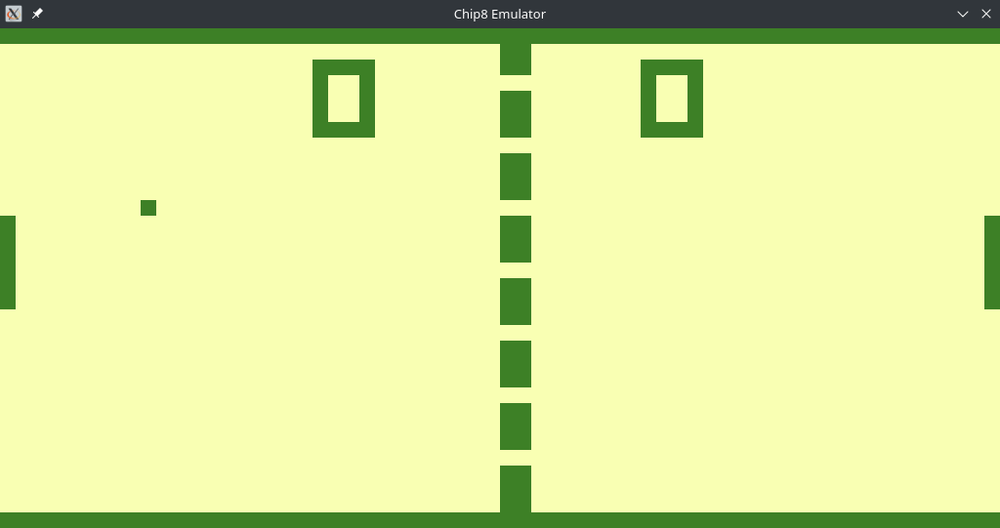

# CHIP-8 Emulator

Readme en Español: [README_ES](README_ES.md)

A CHIP-8 emulator implementation in C using the [SDL2](https://github.com/libsdl-org/SDL) graphics library.
CHIP-8 is an interpreted language created in the mid-70s, originally designed for the COSMAC VIP microcomputer.

## 📸 Screenshots




## 🚀 Building and Running

### Building Steps

Linux:

```console
$ make chip8
```

### Running

```console
$ ./chip8 [Options] ROM
```

Optional parameters:
- `-c`: Running speed, measured in cycles/frame. Recommended values: 7-30. Default: 12.
- `-t`: Chip8 variant to target. Possible variants: Chip8 | SuperChip | XO-Chip. Default is XO-Chip.
- `-h`: Displays help message.

## 🎮 Controls

The original CHIP-8 uses a 16-key hexadecimal keyboard. The keys are mapped as follows:

```
Original Keyboard | QWERTY Keyboard
---------------------------------
    1 2 3 C          1 2 3 4
    4 5 6 D    ->    Q W E R
    7 8 9 E          A S D F
    A 0 B F          Z X C V
```

## ⚙️ Testing

The emulator has been tested using the [Timendus Test Suite](https://github.com/Timendus/chip8-test-suite).
It is capable of passing all tests in the suite, including those related to different Chip8 instruction set variants (SuperChip & XO-Chip).


## 📝 TODOs

- [X] Implement support for Chip8 variants (SuperChipC, XO-Chip, etc.)
- [X] Load configuration from file/command line
- [ ] Add debug tools (breakpoints, register state, etc.)

## 📄 License

This project is licensed under the MIT License - see the [LICENSE](LICENSE) file for details.

## 🔎 References

- [Cowgod's Chip-8 Technical Reference](http://devernay.free.fr/hacks/chip8/C8TECH10.HTM)
- [Tobias V. Langhoff Guide](https://tobiasvl.github.io/blog/write-a-chip-8-emulator/)
- [Matt Mikolay Chip8 Documentation](https://github.com/mattmikolay/chip-8/wiki)
- [Timendus Chip8 Test Suite](https://github.com/Timendus/chip8-test-suite)
- [Chip8 Quirks](https://chip8.gulrak.net/)
- [Chip8 Quirks II](https://github.com/Chromatophore/HP48-Superchip)
